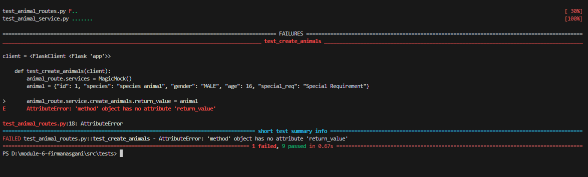

## Run The Code
- Run `pipenv install` & `pipenv shell`
- Run `flask run` or `flask run --debug`

## Flask Installation
This step is applicable if you want to create a Flask project from scratch, if you clone this repo check Run The Code
- Make sure pipenv are installed
- Run `pipenv install flask==3.0.3`

Result of testing:

url for API is https://module-6-firmanasgani-aqgflrqg6q-uc.a.run.app/

